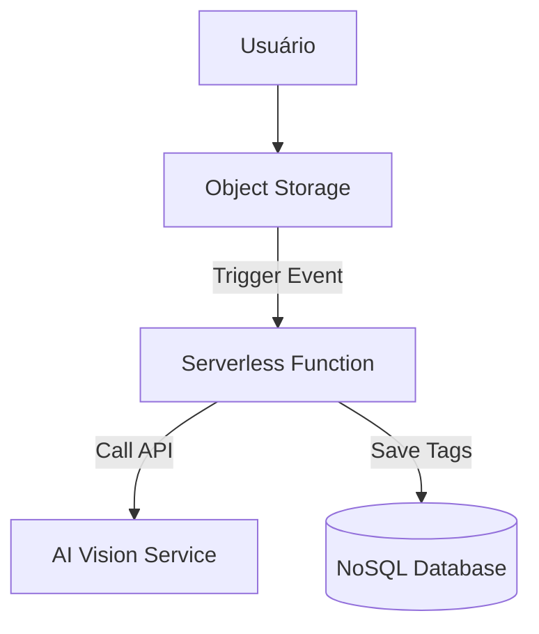

# VisionMind: Análise Inteligente de Imagens

## O Produto
A VisionMind é uma startup de IA que ajuda empresas de mídia a organizarem seus acervos fotográficos. O produto consiste em um pipeline serverless que extrai metadados, tags e descrições de imagens assim que elas são enviadas para o storage da nuvem.

## Topologia e Diagrama


### Fluxo:
1. O usuário faz o upload de uma imagem (PNG/JPG).
2. O Storage dispara um evento de "Object Created".
3. A função serverless é ativada e obtém o link da imagem.
4. A função chama um serviço gerenciado de IA para processar a imagem.
5. Os metadados retornados são salvos em um banco de dados para busca posterior.

## Sugestões de Implementação por Cloud

### 1. AWS (Foco em IA Nativa)
- **Storage:** S3 (Simple Storage Service)
- **Computação:** Lambda
- **Serviço de IA:** AWS Rekognition
- **Banco de Dados:** DynamoDB

### 2. GCP (Foco em ML)
- **Storage:** Cloud Storage
- **Computação:** Cloud Functions
- **Serviço de IA:** Google Cloud Vision AI
- **Banco de Dados:** Firestore

### 3. Azure (Foco em Cognitive Services)
- **Storage:** Blob Storage
- **Computação:** Azure Functions
- **Serviço de IA:** Azure AI Vision (Cognitive Services)
- **Banco de Dados:** CosmosDB

## Como Rodar (Container/Knative)
```bash
docker build -t visionmind-analyzer .
docker run -p 8080:8080 visionmind-analyzer
```
