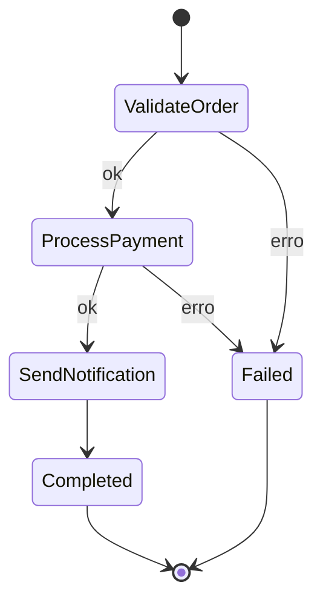

# Especificação — Workflow Processamento de Pedido

## Entrada (`OrderCreated`)

```json
{
  "orderId": "ORD-1001",
  "customerEmail": "cliente@example.com",
  "amount": 150.50,
  "currency": "BRL",
  "simulateFailure": false
}
```

| Campo | Tipo | Regras |
|-------|------|--------|
| `orderId` | string | Obrigatório, não vazio |
| `customerEmail` | string | Obrigatório, contém `@` |
| `amount` | number | Obrigatório, > 0 |
| `currency` | string | Opcional, default `BRL` |
| `simulateFailure` | boolean | Opcional; se `true`, `ProcessPayment` falha |

## Saída de sucesso

```json
{
  "status": "COMPLETED",
  "orderId": "ORD-1001",
  "paymentId": "pay-xxx",
  "notifiedAt": "2026-01-15T12:00:00Z"
}
```

## Saída de falha

```json
{
  "status": "FAILED",
  "orderId": "ORD-1001",
  "step": "ValidateOrder | ProcessPayment",
  "error": "mensagem"
}
```

## Funções (implementar em cada cloud)

### ValidateOrder

- **Input:** evento completo
- **Output:** mesmo objeto + `validated: true`
- **Erro:** `Invalid order` se regras violadas

### ProcessPayment

- **Input:** pedido validado
- **Output:** `{ ...order, paymentId: "pay-<uuid>", paid: true }`
- **Erro:** se `simulateFailure` ou `amount > 10000`

### SendNotification

- **Input:** pedido pago
- **Output:** objeto de sucesso final
- **Side effect:** `print` / log com e-mail do cliente

## Diagrama


