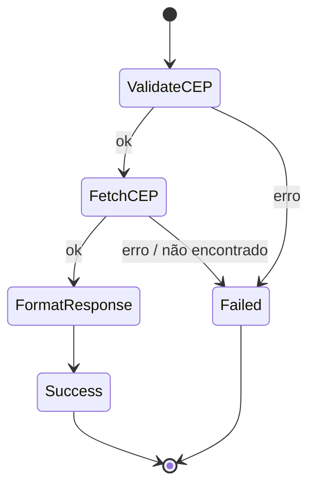

# Especificação — Workflow Busca de CEP

Mesma aplicação em **Python** e **Node.js** nas três clouds. API externa: [ViaCEP](https://viacep.com.br/) (`GET https://viacep.com.br/ws/{cep}/json/`).

## Entrada (`CepLookup`)

```json
{
  "cep": "01001-000",
  "simulateFailure": false
}
```

| Campo | Tipo | Regras |
|-------|------|--------|
| `cep` | string | Obrigatório; 8 dígitos (com ou sem hífen) |
| `simulateFailure` | boolean | Opcional; se `true`, `FetchCEP` falha (teste de erro) |

## Saída de sucesso

```json
{
  "status": "SUCCESS",
  "cep": "01001000",
  "address": {
    "street": "Praça da Sé",
    "complement": "lado ímpar",
    "neighborhood": "Sé",
    "city": "São Paulo",
    "state": "SP",
    "ibge": "3550308"
  },
  "source": "viacep",
  "fetchedAt": "2026-01-15T12:00:00Z"
}
```

## Saída de falha

```json
{
  "status": "FAILED",
  "cep": "00000000",
  "step": "ValidateCEP | FetchCEP",
  "error": "CEP inválido | CEP não encontrado | ..."
}
```

## Funções (implementar em cada cloud e linguagem)

### ValidateCEP

- Remove não-dígitos; exige **8 dígitos**
- **Output:** `{ cep: "01001000", normalized: true, simulateFailure?: boolean }`
- **Erro:** CEP inválido

### FetchCEP

- `GET https://viacep.com.br/ws/{cep}/json/`
- Se resposta `{"erro": true}` → CEP não encontrado
- Se `simulateFailure` → erro simulado
- **Output:** payload anterior + `viacep` (JSON bruto da API)

### FormatResponse

- Mapeia `viacep` → objeto `address` padronizado
- **Output:** resposta de sucesso final

## Diagrama



## CEPs para teste

| CEP | Resultado |
|-----|-----------|
| `01001-000` | São Paulo — Praça da Sé |
| `60175-295` | Fortaleza |
| `00000-000` | Não encontrado (ViaCEP) |
| `123` | Inválido (ValidateCEP) |
