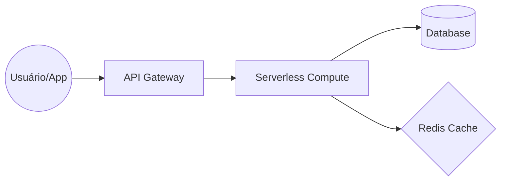

# EcoTrack: Calculadora de Pegada de Carbono

## O Produto
A EcoTrack é uma startup que fornece uma API para empresas calcularem a pegada de carbono de suas operações diárias. Através de endpoints simples, os usuários enviam dados de consumo (energia, viagens, transporte) e recebem o equivalente em KG de CO2.

## Topologia e Diagrama


### Fluxo:
1. O usuário envia uma requisição POST com a atividade e o valor.
2. O componente de computação valida os dados e consulta os fatores de emissão.
3. Os resultados frequentes são armazenados em cache para performance.
4. O histórico de cálculos é persistido no banco de dados.

## Sugestões de Implementação por Cloud

### 1. AWS (Foco em Performance)
- **API:** AWS API Gateway
- **Computação:** AWS Lambda (Python)
- **Banco de Dados:** DynamoDB (NoSQL)
- **Cache:** ElastiCache (Redis)

### 2. GCP (Foco em Integração)
- **API:** Cloud Endpoints ou API Gateway
- **Computação:** Cloud Functions ou Cloud Run (Knative)
- **Banco de Dados:** Firestore
- **Cache:** Cloud Memorystore

### 3. Azure (Foco em Enterprise)
- **API:** Azure API Management
- **Computação:** Azure Functions
- **Banco de Dados:** CosmosDB
- **Cache:** Azure Cache for Redis

## Como Rodar (Container/Knative)
Se desejar rodar como um serviço Knative ou container tradicional:
```bash
docker build -t ecotrack-api .
docker run -p 8080:8080 ecotrack-api
```
