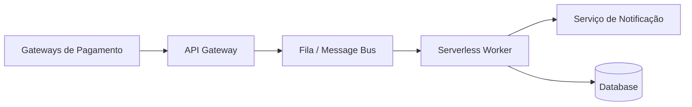

# SwiftPay: Processador de Pagamentos Instantâneos

## O Produto
A SwiftPay é uma plataforma de pagamentos voltada para e-commerce que exige alta disponibilidade e escalabilidade. Este serviço processa webhooks de confirmação de pagamento vindos de diversos gateways e orquestra a notificação dos clientes e atualização de estoque.

## Topologia e Diagrama


### Fluxo:
1. Recebe o Webhook via endpoint HTTPS.
2. Injeta a mensagem em uma fila para garantir que nenhum pagamento seja perdido (Decoupling).
3. O Worker Serverless consome a fila de forma assíncrona.
4. Notifica o sistema de logística e o cliente final.

## Sugestões de Implementação por Cloud

### 1. AWS (Foco em Resiliência)
- **Ingestão:** API Gateway + SQS
- **Computação:** Lambda (Trigger SQS)
- **Notificação:** SNS (Simple Notification Service)
- **Banco de Dados:** Aurora Serverless

### 2. GCP (Foco em Event-Driven)
- **Ingestão:** Cloud Pub/Sub
- **Computação:** Cloud Functions (Pub/Sub Trigger)
- **Notificação:** Firebase Cloud Messaging
- **Banco de Dados:** Cloud SQL (Postgres)

### 3. Azure (Foco em Messaging)
- **Ingestão:** Service Bus
- **Computação:** Azure Functions (Service Bus Trigger)
- **Notificação:** Azure SignalR Service
- **Banco de Dados:** Azure Database for PostgreSQL

## Como Rodar (Container/Knative)
```bash
docker build -t swiftpay-worker .
docker run -p 8080:8080 swiftpay-worker
```
