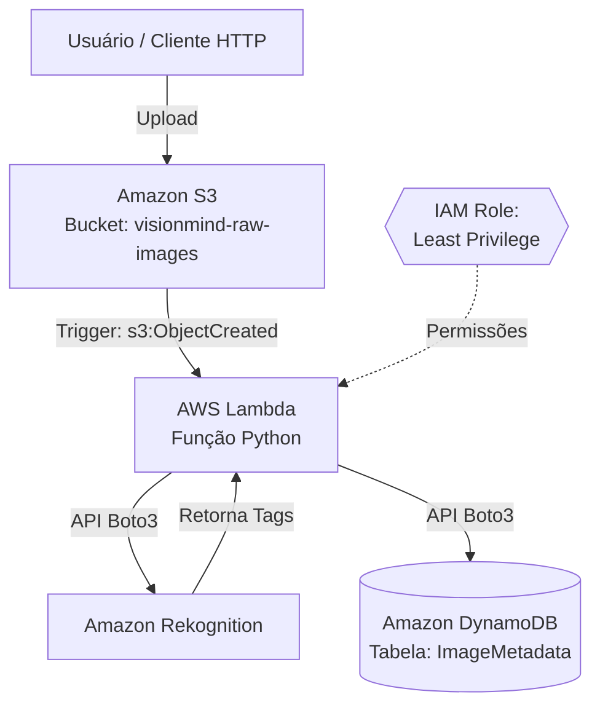

# **Product Requirements Document (PRD)**

**Produto:** VisionMind Analyzer

**Data:** 30 de Junho de 2026

**Status:** Aprovado / Em Implementação

## **Sumário**

* [1\. Visão Geral e Objetivo do Produto](#bookmark=id.he6oya99jy4e)  
* [2\. Público-Alvo e Personas](#bookmark=id.fnfeet6yyozi)  
* [3\. Escopo e Requisitos Funcionais](#bookmark=id.9d8qalh8wj8g)  
* [4\. Arquitetura e Decisões Técnicas](#bookmark=id.satjl1e4b70d)  
* [5\. Requisitos Não Funcionais (NFRs)](#bookmark=id.vza5igv3ji3r)  
  * [5.1. Segurança e Conformidade (Princípios OWASP e IAM)](#bookmark=id.9ueezutr0olw)  
  * [5.2. Escalabilidade e Performance](#bookmark=id.hv1mhcqyn7wg)  
  * [5.3. FinOps e Estimativa de Custo (TCO)](#bookmark=id.lv6xpbmfu95v)  
* [6\. Estratégia de CI/CD e Qualidade (DevSecOps)](#bookmark=id.kz8c301aqjaf)  
* [7\. Métricas de Sucesso e KPIs](#bookmark=id.1a2ybrwdmu79)  
* [8\. Fora de Escopo (Out of Scope)](#bookmark=id.q9boswlb9p6v)

## **1\. Visão Geral e Objetivo do Produto**

A **VisionMind** é uma startup de IA voltada para o mercado corporativo de mídia. O produto em desenvolvimento consiste em um pipeline serverless altamente escalável que extrai, de forma automatizada, metadados, tags descritivas e nível de confiança de imagens assim que são armazenadas na nuvem.

**Objetivo de Negócio:** Eliminar o processo manual de catalogação de acervos fotográficos, acelerando a indexação e a busca em bancos de imagens através de Inteligência Artificial nativa em nuvem, garantindo um modelo de custos sustentável (Pay-as-you-go).

## **2\. Público-Alvo e Personas**

* **Editor de Fotografia:** Profissional que gerencia grandes volumes de imagens e precisa de automação para categorizá-las e torná-las pesquisáveis rapidamente.  
* **Sistemas Parceiros (B2B):** Aplicações de terceiros que enviarão imagens via API/SDK para a nossa infraestrutura e consumirão as tags do banco de dados para suas próprias lógicas de negócio.

## **3\. Escopo e Requisitos Funcionais**

### **User Stories Principais**

* **US01:** Como um Sistema Parceiro, quero fazer upload de uma imagem (JPEG/PNG) para um bucket do S3 para que o processamento seja iniciado automaticamente.  
* **US02:** Como um Sistema de Busca, quero consultar as tags extraídas e a confiabilidade gerada pela IA, para que eu possa exibir imagens relevantes na pesquisa.

### **Fluxo de Ponta a Ponta (Happy Path)**

1. **Ingestão:** O usuário/sistema faz o upload de uma imagem (PNG/JPG) no *Object Storage*.  
2. **Gatilho (Trigger):** O Storage detecta a criação do objeto e dispara um evento.  
3. **Computação:** Uma função serverless é invocada, validando o tipo de arquivo.  
4. **IA:** A função consome um serviço de AI Vision, que retorna um array de tags e percentuais de confiança.  
5. **Persistência:** A função consolida o *payload* e grava o metadado em um banco NoSQL para posterior consumo.

## **4\. Arquitetura e Decisões Técnicas**

O sistema adota uma **Arquitetura Orientada a Eventos (Event-Driven)** e **Serverless**, provisionada através de **Infraestrutura como Código (Terraform)**.

### **Topologia AWS (Stack Escolhida)**

A escolha da Amazon Web Services (AWS) baseia-se na forte integração nativa entre armazenamento, computação e inteligência artificial, minimizando custos de tráfego de rede e o tempo de desenvolvimento.

* **Storage:** Amazon S3 (Bucket).  
* **Computação:** AWS Lambda (Python 3.10).  
* **IA Vision:** Amazon Rekognition (DetectLabels).  
* **Banco de Dados:** Amazon DynamoDB (NoSQL).

### **Fluxo AWS do Projeto**

1. O usuário ou sistema parceiro envia uma imagem JPEG/PNG para o bucket Amazon S3.
2. O S3 detecta o evento de criação do objeto e dispara a execução da AWS Lambda.
3. A Lambda valida a extensão da imagem para aceitar apenas arquivos permitidos.
4. A função chama o Amazon Rekognition para identificar objetos, cenas e etiquetas da imagem.
5. O resultado da análise é montado em um payload com tags e nível de confiança.
6. A Lambda grava os metadados no Amazon DynamoDB para consulta posterior.
7. O sistema retorna status de processamento e deixa o dado pronto para busca e catalogação.

### **Diagrama Arquitetural**

*(Abaixo, a representação em Mermaid da arquitetura. Suportada nativamente no GitLab/GitHub)*

## **5\. Requisitos Não Funcionais (NFRs)**

### **5.1. Segurança e Conformidade (Princípios OWASP e IAM)**

* **Validação de Input (OWASP):** O código Python (Lambda) aplica uma política estrita de *Allowlist* nas extensões de arquivo (.jpg, .jpeg, .png), bloqueando tentativas de injeção de arquivos maliciosos.  
* **IAM Least Privilege:** O perfil de execução do Lambda (configurado no Terraform) possui políticas (Policies) granulares restritas ao ARN (Amazon Resource Name) específico do bucket S3 e da tabela do DynamoDB. Não são permitidas permissões globais (\* em recursos, exceto Rekognition onde é mandatório pela AWS).  
* **Exposição Pública:** Os recursos de Storage (S3) e Database (DynamoDB) não possuem exposição pública (Block Public Access), sendo acessíveis exclusivamente pelo ambiente interno da AWS via roles dedicadas.  
* **Gestão de Segredos:** Ausência de chaves de API ou credenciais de banco de dados *hardcoded* no código-fonte. O acesso é governado via *AssumeRole* nativo do IAM.

### **5.2. Escalabilidade e Performance**

* O sistema opera com paradigma **Scale-to-Zero**, não consumindo capacidade ociosa quando não há uploads.  
* **Cold Start:** O código Python inicializa os clientes Boto3 fora do *handler* para reaproveitamento de conexões TCP, otimizando invocações subsequentes.

### **5.3. FinOps e Estimativa de Custo (TCO)**

A arquitetura opera no modelo **Pay-as-you-go**, sem custos fixos de infraestrutura ociosa. As estimativas abaixo foram baseadas nos preços públicos da [AWS Pricing Calculator](https://calculator.aws/pricing/2/estimator) na região `us-east-1`, julho de 2026.

O **Amazon Rekognition é o principal driver de custo** (~87% do total), cobrado por imagem analisada independentemente do volume de dados. As configurações adotadas (DynamoDB em modo *Pay-Per-Request* e limite `MaxLabels=10` no Rekognition) visam minimizar esse gasto desde a baseline.

#### **Estimativa Mensal por Cenário**

| Serviço | MVP · 1k imgs/mês | Startup · 50k imgs/mês | Escala · 500k imgs/mês |
|---|---|---|---|
| Amazon Rekognition | $1,00 | $50,00 | $500,00 |
| AWS Lambda | $0,00* | $0,83 | $8,30 |
| Amazon S3 | $0,02 | $1,15 | $11,50 |
| Amazon DynamoDB | $0,00* | $0,06 | $0,63 |
| Amazon API Gateway | $0,00* | $5,00 | $50,00 |
| **Total/mês** | **~$1,02** | **~$57,04** | **~$570,43** |
| **TCO anual** | **~$12** | **~$685** | **~$6.845** |

*\*Coberto pelo AWS Free Tier (1M req Lambda, 25 GB DynamoDB, 1M req API Gateway por mês).*

#### **Estratégias de Otimização**

Como o Rekognition concentra a maior parte do gasto, as otimizações são priorizadas para reduzir chamadas à API de IA antes de qualquer outra frente:

1. **Cache de resultados do Rekognition:** Armazenar o hash SHA-256 de cada imagem no DynamoDB e consultar antes de invocar o Rekognition. Em acervos com imagens duplicadas ou reprocessadas, reduz 30–60% das chamadas à IA — maior impacto isolado.
2. **Graviton (ARM64) na Lambda:** Alterar `Architectures: arm64` no `template.yaml`. Redução de ~20% no custo de compute com zero mudança de código.
3. **S3 Intelligent-Tiering:** Imagens já processadas raramente são relidas. A transição automática para Infrequent Access reduz o custo de storage em ~40%.
4. **DynamoDB Provisioned em escala:** Acima de ~200k imagens/mês, migrar de On-demand para Provisioned Capacity com Auto Scaling oferece economia de até 70% no banco de dados.

Com a aplicação das estratégias acima no cenário de 50k imagens/mês, o custo mensal estimado cai de **$57,04 para ~$36,00 (~37% de redução)**.

## **6\. Estratégia de CI/CD e Qualidade (DevSecOps)**

O projeto adota uma esteira de *Continuous Integration / Continuous Deployment* gerenciada via **Jenkins**, utilizando *runners* hospedadas em infraestrutura Windows nativa.

* **SAST (Static Application Security Testing):** Varredura no código Python utilizando **Semgrep** para detectar injeções e falhas lógicas antes da compilação.  
* **SCA (Software Composition Analysis):** Geração de SBOM via **cdxgen** integrado ao *Dependency Track* para validar vulnerabilidades em bibliotecas de terceiros.  
* **Automação (IaC):** O processo de deploy compacta a aplicação nativamente (Compress-Archive) e aplica as mudanças de infraestrutura utilizando o binário do **Terraform**. As credenciais de deploy da nuvem ficam armazenadas como segredos no Jenkins e são expostas temporariamente durante a pipeline.

## **7\. Métricas de Sucesso e KPIs**

1. **Performance:** Tempo médio de processamento total (Upload até DynamoDB) inferiror a 3 segundos.  
2. **Segurança:** 0 (zero) vulnerabilidades Críticas ou Altas reportadas pelos scans SAST/SCA durante a etapa de *build*.  
3. **Disponibilidade:** Taxa de sucesso de processamento \> 99.9%.

## **8\. Fora de Escopo (Out of Scope)**

Nesta fase, **NÃO** faz parte da entrega:

* Frontend (Interface gráfica do usuário para consulta e upload manual).  
* Processamento e marcação de vídeos (Apenas imagens estáticas suportadas).  
* Configuração de infraestrutura Cloud *Multi-Region* (Disaster Recovery Avançado).